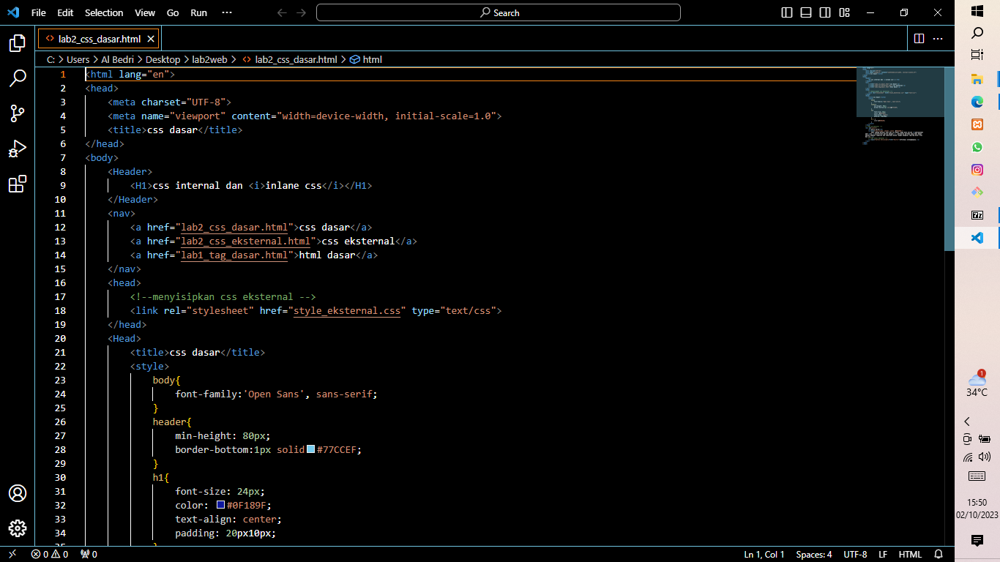
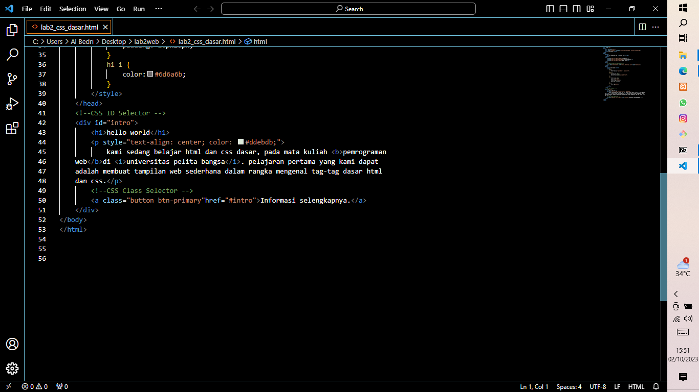
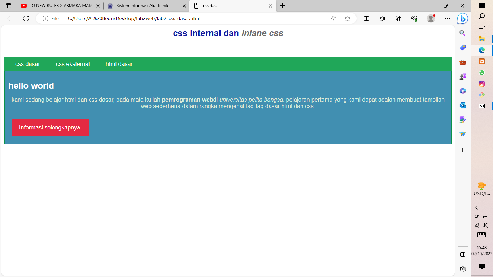

# Lab2Web
# Nama  : Ramadhan Ardi Iman Prakoso
# Kelas : TI.22.A3
# NIM   : 312210722
1. Menambahkan dan Merubah Property dan Nilai 

Saya merubah warna dan posisi pada tulisan hello word dan juga saya merubah jenis teks pada font family pada body.

2. Elemen h1 mencakup intro h1, Elemen h1 meliputi juga button navigasi dan #intro h1 yang bertulis hello word

3. Yang tampil duluan adalah CSS internal terlebih dahulu karena 1 file  dengan HTML

4. Yang akan ditampilkan sebagai file css adalah elemen 'class' karena elemen 'class' mendeklarasikan class CSS yang digunakan. sedangan ID menetukan ID unik yang terdapat pada elemen contohnya : <a class="button btn-primary"href="intro">
